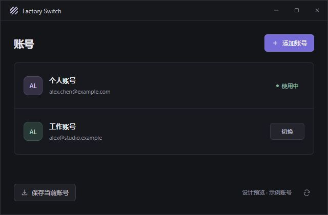

<div align="center">

# Factory Switch

**用于 Factory / Droid 的本机多账号切换工具**

保存账号 · 一键切换 · 查看用量

[下载安装](https://github.com/shelbyluocus-wq/factory-switch/releases/tag/v0.2.0) · [使用方法](#使用方法) · [macOS 说明](MACOS.md) · [问题反馈](https://github.com/shelbyluocus-wq/factory-switch/issues)

</div>

---

Factory Switch 将 Factory 的登录状态加密保存在本机，切换时保存当前账号、正常退出 Factory、恢复目标账号并重新启动 Factory。

这是一个**非官方工具**，不属于 Factory 官方产品。使用前请完成正在运行的任务，并在切换后确认 Factory 中的账号和连接状态。

## 下载

从 [v0.2.0 Releases](https://github.com/shelbyluocus-wq/factory-switch/releases/tag/v0.2.0) 下载对应平台的安装包。安装包已包含 Python 运行环境，**无需另装 Python**。

| 平台 | 安装包 | 安装方式 |
| --- | --- | --- |
| Windows x64 | [FactorySwitch-0.2.0-windows-x64-setup.exe](https://github.com/shelbyluocus-wq/factory-switch/releases/download/v0.2.0/FactorySwitch-0.2.0-windows-x64-setup.exe) | 运行安装程序，按提示安装 |
| macOS Apple Silicon | [FactorySwitch-0.2.0-macos-arm64.dmg](https://github.com/shelbyluocus-wq/factory-switch/releases/download/v0.2.0/FactorySwitch-0.2.0-macos-arm64.dmg) | 打开 DMG，将应用拖入 Applications |
| macOS Intel | [FactorySwitch-0.2.0-macos-x64.dmg](https://github.com/shelbyluocus-wq/factory-switch/releases/download/v0.2.0/FactorySwitch-0.2.0-macos-x64.dmg) | 打开 DMG，将应用拖入 Applications |

- Windows 需要 Microsoft Edge WebView2 Runtime。若启动时提示缺失，可从 [Microsoft 官方页面](https://developer.microsoft.com/en-us/microsoft-edge/webview2/) 安装。
- macOS 最低版本设为 13，自动构建使用 macOS 15。其他系统版本的实际兼容性仍需验证。
- 安装包未使用 Windows 发布者证书或 Apple Developer ID 进行分发签名，macOS 也未完成公证，首次打开可能出现系统提示。
- Release 提供 [SHA256SUMS.txt](https://github.com/shelbyluocus-wq/factory-switch/releases/download/v0.2.0/SHA256SUMS.txt)，可用于核对下载文件。
- `main` 分支已有 v0.2.0 标签之后的进程退出修复和图标更新；这些改动尚未包含在 v0.2.0 发布版本中。

## 主要功能

- **保存当前账号**：加密备份登录状态，可添加账号备注。
- **切换账号**：保存离开账号时的最新登录状态，恢复目标账号并重启 Factory。
- **查看用量**：按接口实际返回的数据，显示 Standard / Droid Core 的时间窗口用量，或组织与个人额度。
- **本机加密备份**：Windows 使用 DPAPI；macOS 使用 AES-256-GCM，备份密钥存于系统钥匙串。
- **保留现有资料**：保留项目、会话与设置，仅替换认证文件和组织策略缓存。
- **操作保护**：检测仍在运行的 Factory / Droid，保留加密恢复点，并在部分失败情况下回滚。

<details>
<summary>查看界面预览</summary>



这是早期界面的设计预览，使用示例账号，不包含真实用户邮箱。当前版本还会显示账号用量。

</details>

## 使用方法

1. 安装 Factory Desktop，并在其中正常登录第一个账号。
2. 打开 Factory Switch，点击 **保存当前账号**，可填写备注。
3. 点击 **添加账号**，在重新打开的 Factory 中登录另一个账号。
4. 返回切号器，再次点击 **保存当前账号**。
5. 之后点击账号右侧的 **切换**，并在 Factory 中确认切换结果。

**刷新**：点击右下角刷新按钮，或使用 Windows 的 `Ctrl+R` / macOS 的 `Command+R`。

切换前请完成正在运行的任务。如果另有独立 Droid CLI 或其他位置安装的 Factory 正在运行，请先正常退出后重试。

### 用量显示

用量查询使用 Factory 的只读接口，不刷新登录 token。不同账号可能返回不同的数据：有的提供 5 小时、周和月的用量比例，有的只提供组织或个人总额度。缺少字段不代表用量为零，也不能据此判断会员状态。

界面缓存用量约 60 秒，手动刷新会重新查询。查询失败时显示错误；已有数据显示时会保留并标记为旧数据。用量查询不占用账号切换的操作锁。

### macOS 首次授权

首次保存账号可能提示系统钥匙串访问；切换时也可能提示自动化授权，以便请求 Factory 正常退出。拒绝授权时应停止操作并显示错误。具体步骤与实机验收要求见 [MACOS.md](MACOS.md)。

## 数据与隐私

| 平台 | 备份目录 | 加密方式 |
| --- | --- | --- |
| Windows | `%LOCALAPPDATA%\FactoryAccountSwitcher` | 当前 Windows 用户的 DPAPI |
| macOS | `~/Library/Application Support/FactoryAccountSwitcher` | AES-256-GCM，密钥存于系统钥匙串 |

账号备份不保存明文 token。真实登录文件、账号备份、系统密钥和环境变量文件不应提交到 GitHub；忽略规则见 [.gitignore](.gitignore)。Windows 与 macOS 备份**不能直接互换**，在另一台电脑上也需要重新登录保存。

多个账号仍共用 Factory 的项目、会话与设置，这**不是完全隔离的账号环境**。历史记录、组织界面和第三方授权的跨账号显示与隔离仍需单独确认。

## 兼容性与验证范围

认证协议曾依据 Factory Desktop **0.189.0** 的应用代码核对。Factory 后续版本若改变认证存储格式，可能需要更新适配。

- Windows：历史验证记录包含本机双账号往返切换及只读 `whoami` 身份核对，详见 [VALIDATION.md](VALIDATION.md)。
- macOS：支持 `auth.v2.loginkeychain` 与 `auth.v2.keyring`；模拟测试和原生打包检查已通过，真实账号切换、钥匙串授权及桌面交互尚未实机验证。
- GitHub Actions 已完成 Windows x64、macOS arm64 和 macOS x64 的原生构建、测试与打包资源检查。构建通过不等于所有用户环境均已验证。

验证记录：[Windows](VALIDATION.md) · [界面](UI_VALIDATION.md) · [macOS](MACOS_VALIDATION.md) · [发布构建](RELEASE_VALIDATION.md)。

## 从源码运行

需要 Python 3.11 或更新版本。

### Windows

```powershell
python -m venv .venv
.venv\Scripts\python -m pip install -r requirements.txt
.\Launch.cmd
```

### macOS

```bash
bash Launch.command
```

启动器会创建独立的 `.venv-mac` 并安装依赖。默认寻找 `/Applications/Factory.app` 或 `~/Applications/Factory.app`，其他安装位置可通过 `FACTORY_SWITCHER_APP` 指定。

### 测试与打包

以下命令需使用已安装项目依赖的 Python 环境：

```bash
python -m pip install -r requirements-build.txt
python -X utf8 -m unittest -v
node scripts/test-ui-startup.cjs
```

- Windows：运行 `python -m PyInstaller --noconfirm FactorySwitch.windows.spec`，然后用 Inno Setup 6 编译 `installer/windows.iss`。
- macOS：双击 `Build-mac.command`，或运行 `python -m PyInstaller --noconfirm FactorySwitch.mac.spec`。
- 打包后检查：运行 `python scripts/smoke_package.py`，验证原生依赖和界面资源，不执行真实账号操作。
- 示例界面预览：运行 `python gui.py --preview`。

macOS 应用需在 Mac 上构建，Windows 安装包需在 Windows 上构建。自动构建配置见 [release.yml](.github/workflows/release.yml)，构建产物位于 `dist/`，不纳入 Git。

### 恢复最近一次切换前的状态

先完成运行中的任务，正常退出 Factory 与 Droid，再从源码目录运行：

```bash
python switcher.py recover
```

请使用已安装依赖的 Python 环境。恢复依赖本机的加密恢复点；完成后仍需在 Factory 中确认账号和连接状态。

## 项目结构

```text
gui.py                    桌面窗口与 Python 桥接层
switcher.py               账号备份、切换与恢复核心
mac_backend.py            macOS 钥匙串和进程适配
window_frame.py           Windows 窗口缩放支持
usage.py                  只读用量查询
ui/                       HTML / CSS / JavaScript 与应用图标
installer/                Windows 安装程序配置
scripts/                  图标生成和打包检查
legacy/gui_tk.py           早期 Tkinter 界面，当前桌面入口不使用
.github/workflows/        多平台自动构建
```

## 问题反馈

通过 [Issues](https://github.com/shelbyluocus-wq/factory-switch/issues) 反馈时，请提供操作步骤、系统版本、Factory 版本和脱敏后的错误信息。请勿上传真实账号邮箱、token、登录文件、加密备份或系统密钥。
